<p align="center">
  
</p>

<h1 align="center">YT Download Manager</h1>

<p align="center">
  A free, open-source <b>YouTube downloader for Windows</b>. Download videos in up to 8K quality, convert
  YouTube to MP3, and save Shorts, thumbnails and subtitles with one click, right from a toolbar under every video.
</p>

<p align="center">
  <a href="https://github.com/NyxiYT/yt-download-manager/releases/latest"></a>
  <a href="LICENSE"></a>
</p>

<p align="center">
  <b><a href="https://github.com/NyxiYT/yt-download-manager/releases/latest">Download the latest release</a></b>
  ·
  <a href="https://nyxiyt.github.io/yt-download-manager/">Website</a>
</p>


YT Download Manager has two parts that work together:

- **The browser extension** adds a small toolbar under every YouTube video and buttons beside every Short.
  This is where you pick what to download.
- **The Windows app** does the downloading in the background. It saves the files to a folder on your PC,
  converts them, and keeps going even when you close the tab.

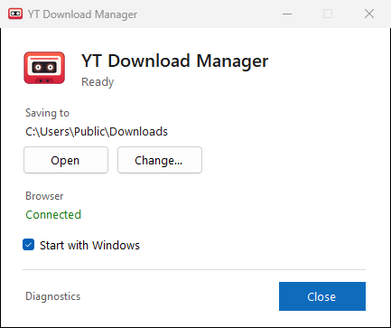

## Contents

- [Features](#features)
- [Download](#download)
- [Installation](#installation)
- [How to use](#how-to-use)
- [System requirements and compatibility](#system-requirements-and-compatibility)
- [FAQ](#faq)
- [Troubleshooting](#troubleshooting)
- [Feedback](#feedback)
- [Support the project](#support-the-project)
- [Contributing](#contributing)
- [Legal note](#legal-note)
- [License](#license)

## Features

**Downloading**

- **Download videos in up to 8K quality.** Every resolution the video has, from 144p up to 4320p (8K), with 60 fps and HDR
  where YouTube offers them. The highest one is picked for you. 1440p, 4K and 8K need the Windows app (see
  [compatibility](#system-requirements-and-compatibility)).
- **YouTube to MP3.** Save just the audio as MP3 (with the video's picture as cover art), M4A, Opus or WAV.
- **Only the part you need.** Set a start and end time to download a short clip instead of the whole video.
- **Thumbnails.** Save a video's preview picture in full size. Shorts also offer their tall portrait picture.
- **Subtitles.** Save the video's subtitles as a file.
- **Screenshots.** Save the exact frame you are watching as a picture.
- **YouTube Shorts.** Every Short gets a Download button beside it, with the same choices as normal videos.
- **Age-restricted and members-only videos.** If your YouTube account may watch a video, the app can download
  it too, using your own sign-in from the browser.

**The app**

- **Saves to any folder.** Your Downloads folder by default. You can pick another one at any time.
- **Fast.** Large files are downloaded in several parts at once.
- **Keeps going.** Downloads continue when you close the tab, and pick up again after a restart.
- **Your video comes first.** When the video you are watching needs the connection, downloads slow down
  for a moment so your video doesn't stutter.
- **Runs quietly.** It starts with Windows and waits in the system tray (the small icons next to the clock).
- **Light or dark.** The app and its installer follow your Windows setting for light or dark mode.
- **Updates itself.** When a new version is out, one click installs it. The browser extension follows on its own.
- **Easy to repair or remove.** Open the installer again and pick **Repair** or **Uninstall**.
- **Stays up to date with YouTube.** Its download engine (yt-dlp) updates itself about once a week.
- **Connects by itself.** The extension finds the app on its own. There is nothing to set up.

**Watching**

- **Download history.** A clock button in YouTube's top bar shows your downloads, their progress and where
  they were saved.
- **Big Picture.** Keeps the video in view in a corner while you scroll through comments.
- **Picture-in-picture for Shorts.** Watch Shorts in a small window on top of your other windows. Scroll or
  use the arrow keys to go to the next Short. The window keeps the video's shape when you resize it.
- **Back and forward through Shorts.** Going back shows the Shorts you already watched, in order.
- **Loop and theme.** Repeat a video, or switch YouTube between light and dark with one click.
- **10 languages.** English, German, Spanish, French, Italian, Portuguese, Polish, Russian, Japanese and Chinese.

## Download

| What | For | File |
|---|---|---|
| Windows app (64-bit) | Most Windows PCs | [YTDownloadManager-Setup-x64.exe](https://github.com/NyxiYT/yt-download-manager/releases/latest/download/YTDownloadManager-Setup-x64.exe) |
| Windows app (32-bit) | Older PCs with 32-bit Windows | [YTDownloadManager-Setup-x86.exe](https://github.com/NyxiYT/yt-download-manager/releases/latest/download/YTDownloadManager-Setup-x86.exe) |
| Browser extension only | Linux, macOS, or without the app | [YTStandaloneDownloader-Extension.zip](https://github.com/NyxiYT/yt-download-manager/releases/latest/download/YTStandaloneDownloader-Extension.zip) |
| Userscript | Tampermonkey users | [yt-standalone-downloader.user.js](https://github.com/NyxiYT/yt-download-manager/releases/latest/download/yt-standalone-downloader.user.js) |
| Checksums | Checking that a download is complete | [SHA256SUMS.txt](https://github.com/NyxiYT/yt-download-manager/releases/latest/download/SHA256SUMS.txt) |

The Windows installers already contain the browser extension. You don't need to download it separately.

**Not sure if your Windows is 64-bit or 32-bit?** Press the Windows key, type `About your PC` and open it.
Look at **System type**. If it says "64-bit operating system", take the 64-bit file. Almost all PCs from the
last 10 years are 64-bit.

## Installation

### Windows 64-bit

**1. Download** [YTDownloadManager-Setup-x64.exe](https://github.com/NyxiYT/yt-download-manager/releases/latest/download/YTDownloadManager-Setup-x64.exe)
and open it.

**2. If Windows shows "Windows protected your PC",** click **More info**, then **Run anyway**.
Windows shows this for new apps that aren't signed with a paid certificate. See the [FAQ](#why-does-windows-say-windows-protected-your-pc).

**3. Click Install.** You don't need administrator rights. The app installs only for your Windows user.

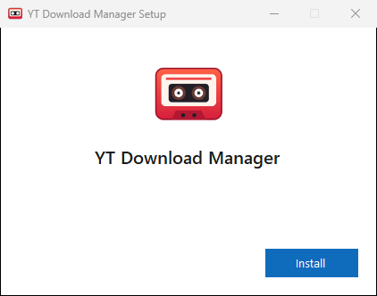

**4. Wait a few seconds** while it installs.

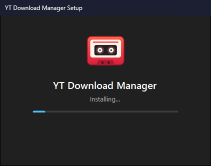

**5. Click Open.**

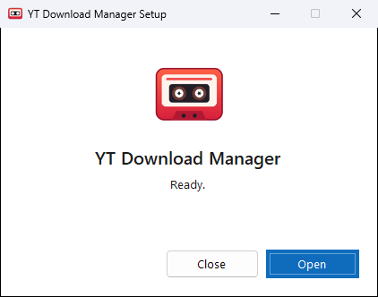

**6. Click "Add to browser"** in the app window. Your browser opens its extensions page, and the app copies
the extension's folder path for you (it is now on your clipboard).

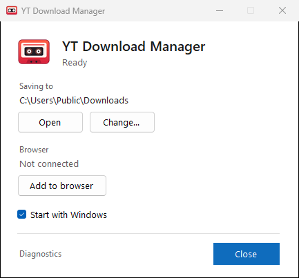

**7. Add the extension to your browser:**

1. Turn on **Developer mode** (the switch in the top right corner).
2. Click **Load unpacked** (top left).
3. A folder window opens. Click into its address bar at the top, press **Ctrl+V** to paste the path, and
   press **Enter**.
4. Click **Select Folder**.

The extension now shows up on the page.

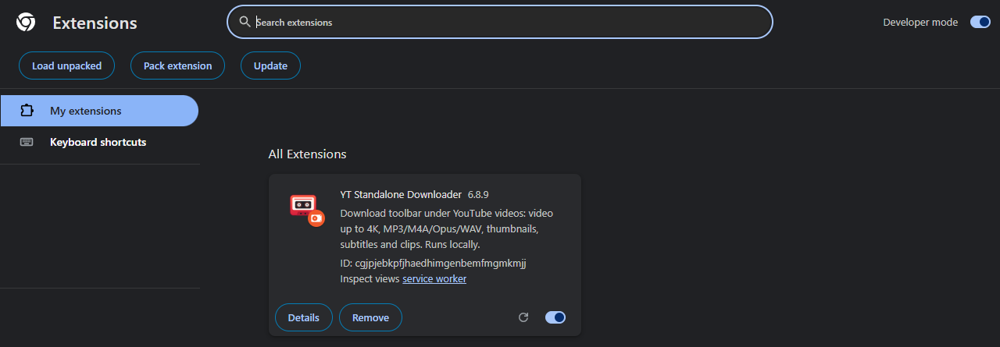

**8. Open any YouTube video.** If YouTube was already open, refresh the tab first (press **F5**).
The toolbar appears under the video, and the app window now says **Connected**.


That's it. From now on the app starts with Windows, and the extension connects to it by itself.

### Windows 32-bit

The steps are the same as for [Windows 64-bit](#windows-64-bit). The only difference is the file in step 1:
download [YTDownloadManager-Setup-x86.exe](https://github.com/NyxiYT/yt-download-manager/releases/latest/download/YTDownloadManager-Setup-x86.exe)
instead. The windows look exactly the same.

### With Scoop

If you use [Scoop](https://scoop.sh), open PowerShell and run:

```powershell
scoop bucket add nyxiyt https://github.com/NyxiYT/yt-download-manager
scoop install nyxiyt/yt-download-manager
```

Scoop picks the 64-bit or 32-bit version for you. Then open **YT Download Manager** from the Start menu and
continue with step 6 of the [Windows 64-bit](#windows-64-bit) guide to add the extension.

### Linux

The Windows app doesn't run on Linux. You can still use the browser extension on its own, in Chrome,
Chromium, Edge or Brave:

1. Download [YTStandaloneDownloader-Extension.zip](https://github.com/NyxiYT/yt-download-manager/releases/latest/download/YTStandaloneDownloader-Extension.zip)
   and unzip it into a folder you keep (for example `~/yt-extension`).
2. Open `chrome://extensions` in your browser.
3. Turn on **Developer mode** and click **Load unpacked**.
4. Select the unzipped folder (the one that contains `manifest.json`).
5. Open a YouTube video. The toolbar appears under it.

Without the app, the extension downloads inside the browser. YouTube blocks this on many internet
connections, so it may not work for you. The extension has not been tested on Linux yet (see
[compatibility](#system-requirements-and-compatibility)).

## How to use

### Download a video

1. Open a video on YouTube.
2. Click the **camera button** (the first button in the toolbar under the video).
3. Pick a **Quality**. The highest one is already selected. The size of the file is shown next to it.
4. Optional: drag the two dots under **Trim** to keep only a part of the video.
5. Click **Download**.

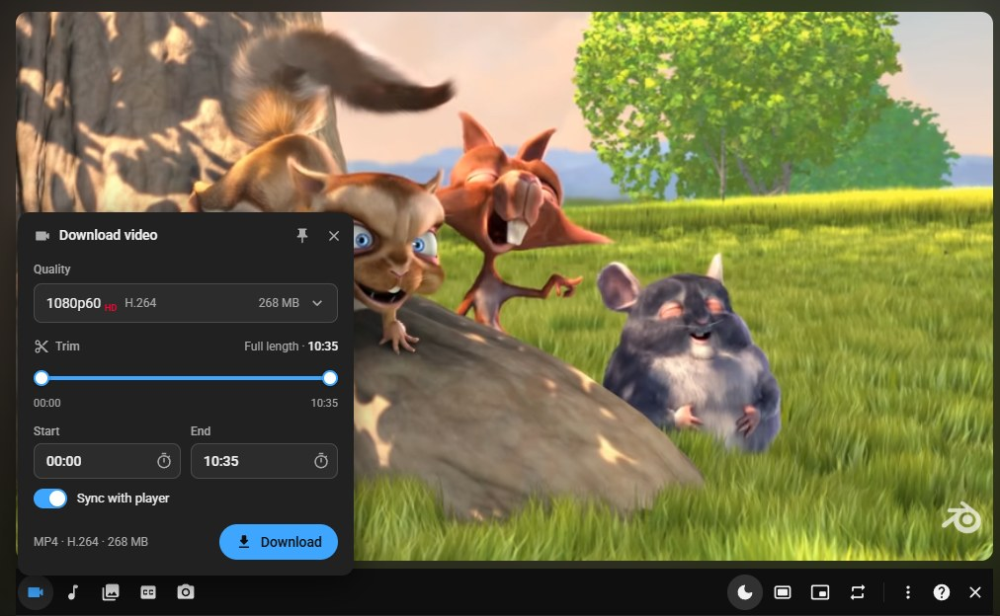

### Download music as MP3

1. Click the **music note button** in the toolbar.
2. Pick a **Format**. MP3 at 320 kb/s works on every device and gets the video's picture as cover art.
3. Click **Download**.

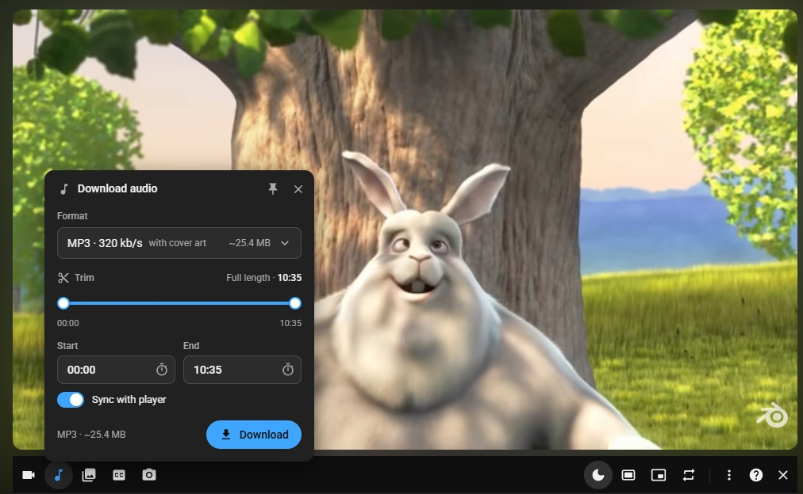

### Download a Short

1. Open a Short.
2. Click **Download** beside the Short (above YouTube's like button).
3. Pick what you want: the video, the audio, the thumbnail, the subtitles or a screenshot.

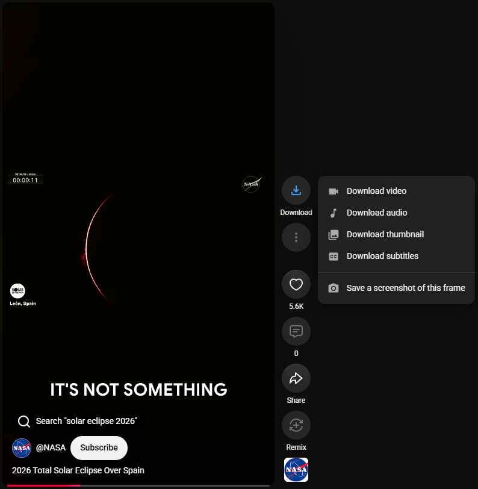

### Find your downloads

Click the **clock button** in YouTube's top bar, next to YouTube's own buttons. It lists your downloads.
Click the **folder icon** next to a download to open the folder it is in. While something downloads,
a ring around the clock fills up to show the progress.

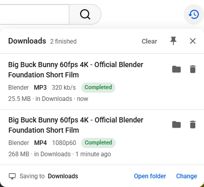

### Change the download folder or other settings

- **Download folder:** open the app (double-click its icon in the system tray, next to the clock) and click
  **Change…** under "Saving to". You can also click **Change** at the bottom of the download history.
- **Extension settings:** right-click the extension's icon in the browser toolbar and choose **Options**.
  There you can change the language, hide the toolbar, and more.

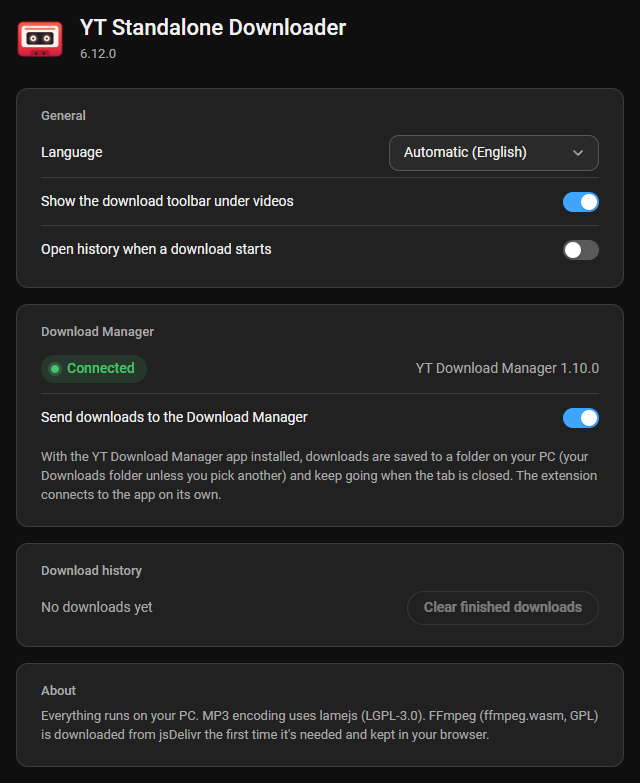

## System requirements and compatibility

### Tested platforms

| Platform | Architecture | Status |
|---|---|---|
| Windows 11 | x64 (64-bit) | ✅ Tested: installs, runs, downloads videos in up to 8K quality (HDR included) and MP3s |
| Windows 11 | x64, running the 32-bit (x86) build | ✅ Tested: the 32-bit app and its 32-bit tools download in up to 8K quality, files over 4 GB included |
| Windows 10 | x64 (64-bit) | ⚠️ Not tested |
| Windows 10 | x86 (32-bit) | ⚠️ Not tested |
| Linux (Ubuntu 24.04 LTS and others) | x64 | ⚠️ Not tested. Browser extension only, no app, so no 1440p, 4K or 8K in most cases |
| macOS | any | ❌ No app. The browser extension may work, not tested |

| Browser | Status |
|---|---|
| Google Chrome 154 | ✅ Tested |
| Microsoft Edge, Brave, Opera, Vivaldi (version 111 or newer) | ⚠️ Not tested. They are built on the same base as Chrome |
| Firefox | ❌ Not supported by the extension |

### Video quality

With the Windows app, you get every quality YouTube offers for a video, up to 8K (4320p), including 60 fps
and HDR. Without the app (the browser extension alone, for example on Linux), the browser only gets what
YouTube gives it directly: usually up to 1080p.

8K files are big: an hour of 8K video is about 14 GB. Playing them smoothly needs a fast PC. Downloading them
works on every PC the app runs on.

### Requirements

| | Minimum |
|---|---|
| Windows | Windows 10 or 11, 64-bit or 32-bit |
| Browser | Chrome, Edge, Brave, Opera or Vivaldi, version 111 or newer |
| Memory (RAM) | 2 GB. The app itself uses about 50 MB |
| Disk space | About 300 MB for the 64-bit app (230 MB for 32-bit), plus space for your downloads. While a video downloads, it needs about twice its size for a moment |
| Internet | Needed for every download |
| Other software | None. The installer brings everything it needs: yt-dlp, FFmpeg, and Deno (64-bit) or Node.js (32-bit). .NET Framework 4.8 is already part of Windows 10 (version 1903 and newer) and Windows 11 |

## FAQ

### Why does Windows say "Windows protected your PC"?

Windows shows this warning for apps that are new and not signed with a paid code-signing certificate.
It doesn't mean the app is harmful. Click **More info**, then **Run anyway**. If you want to be extra sure,
compare the file's checksum with the one in [SHA256SUMS.txt](https://github.com/NyxiYT/yt-download-manager/releases/latest/download/SHA256SUMS.txt)
(in PowerShell: `Get-FileHash .\YTDownloadManager-Setup-x64.exe`). The full source code is in this repository.

### Where are my downloaded files?

In your **Downloads** folder, unless you picked another one. To see the folder, click the folder icon
next to a download in the download history, or open the app and click **Open** under "Saving to".

### How do I update?

The app does it for you (version 1.9.0 and newer). When a new version is out, a notification says so. Click it,
or click **Update** in the app window or at the top of the tray icon's menu. The app downloads the new version,
installs it and starts again. Your settings and downloads stay. The browser extension updates itself as well,
as soon as no YouTube tab is open.

You can also update by hand: download the newest installer from the
[latest release](https://github.com/NyxiYT/yt-download-manager/releases/latest) and open it. It sees the version
you have and offers **Update**.

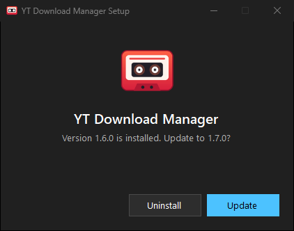

**Coming from version 1.8.0 or older?** After this one update, open your browser's extensions page
(`chrome://extensions`), click the **reload** icon (the round arrow) on the YT Standalone Downloader card and
refresh your YouTube tabs. From then on the extension updates itself.

Installed with Scoop? `scoop update yt-download-manager` works too.

### Something is broken. How do I repair the app?

Open the installer again (the same version you have). It offers **Repair**. Click it. This puts back all of the
app's files and tools and keeps your settings.

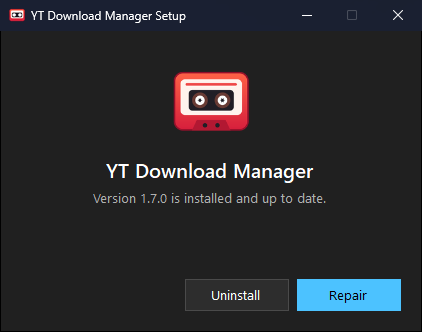

### How do I uninstall?

Open the installer again and click **Uninstall**. It asks once more before it removes anything.

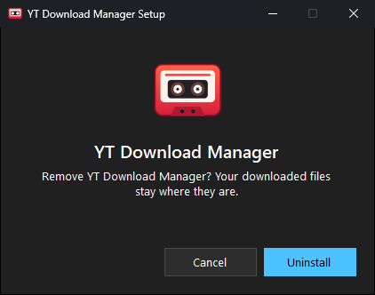

You can also uninstall it like any other app: open Windows **Settings** → **Apps** → **Installed apps**, find
**YT Download Manager**, click the three dots next to it and choose **Uninstall**.

Uninstalling removes everything the app put on your PC: the program, its settings, logs, temporary files and
tools, the shortcuts, and all of its registry entries. Your downloaded videos stay where they are.

Two things are up to you afterwards:

1. Open your browser's extensions page (`chrome://extensions`) and click **Remove** on the YT Standalone
   Downloader card. This also deletes the extension's settings and download history in the browser.
2. Delete the installer file (`YTDownloadManager-Setup-x64.exe`) from your Downloads folder if you still have it.

### What do I do when a download fails?

1. Open the download history (the clock button). It shows the reason and, often, a button to try again.
2. Make sure the app is running. Its icon should be in the system tray, next to the clock. If it isn't,
   start **YT Download Manager** from the Start menu.
3. Try again a few minutes later. YouTube sometimes refuses downloads for a short while.
4. Still failing? [Open an issue](https://github.com/NyxiYT/yt-download-manager/issues/new/choose) and add
   the app's log: open the app, click **Diagnostics**, and attach `manager.log`.

### Is it free? Does it collect data?

It is free and open source. There are no ads, no accounts and no tracking. The extension talks only to
YouTube, to the app on your own PC, and to jsDelivr (a public file host) to fetch FFmpeg if the browser
has to convert a file itself. The app asks GitHub for a new version at most every 12 hours. That request
carries nothing about you or your PC. To turn it off, close the app and add `"checkUpdates": false` to
`%LOCALAPPDATA%\YT Download Manager\settings.json`.

## Troubleshooting

| Problem | Fix |
|---|---|
| The toolbar doesn't show under videos | Refresh the YouTube tab (F5). Check that the extension is turned on in `chrome://extensions`. If you hid the toolbar, click the extension's icon and choose **Show download toolbar** |
| The app says **Not connected** | Open or refresh a YouTube tab. The extension connects when YouTube loads. If it still says "Not connected", click the reload icon on the extension's card in `chrome://extensions` |
| "YouTube refused the download" or downloads stop at once | Make sure the app is running. In the extension's options, turn on **Send downloads to the Download Manager** |
| An age-restricted or members-only video won't download | Sign in to YouTube in the same browser, with an account that may watch the video |
| The toolbar shows up twice | You have both the extension and the userscript turned on. Turn one of them off |
| Downloads are slow while you watch a video | That's on purpose: downloads make room for your video. They speed up again by themselves |
| Your antivirus warns about the installer | New, unsigned apps sometimes trigger warnings. Compare the checksum (see the [FAQ](#why-does-windows-say-windows-protected-your-pc)) and report it to your antivirus vendor as a false positive |
| After an update, things behave like the old version | Click the reload icon on the extension's card in `chrome://extensions`, then refresh your YouTube tabs |

## Feedback

- Found a bug? [Report it](https://github.com/NyxiYT/yt-download-manager/issues/new/choose).
- Have a question or an idea? Start a [discussion](https://github.com/NyxiYT/yt-download-manager/discussions).

## Support the project

This project is free and made in my spare time. If it saves you time, you can support it with a donation.
Thank you!

**Bitcoin (BTC)**


```
bc1qwvn59c0yrhc9xwd9x9hrgwm4exe84xx0tdazdv
```

**USDT (Ethereum, ERC-20)**


```
0x2871854E89Cf7D070e8d569A407B6432Da7F0dF5
```

> ⚠️ Only send USDT on the Ethereum (ERC-20) network. Other networks will lose the funds.

## Contributing

Bug fixes, translations and ideas are welcome. [CONTRIBUTING.md](CONTRIBUTING.md) explains how to set up,
build and test the project, and how to send a fix. Please follow the [Code of Conduct](CODE_OF_CONDUCT.md).
To report a security problem, see [SECURITY.md](SECURITY.md).

## Legal note

This tool is meant for downloading videos you are allowed to download: your own videos, videos with a free
license (such as Creative Commons), or videos you have permission to save. You are responsible for following
[YouTube's Terms of Service](https://www.youtube.com/t/terms) and the copyright laws of your country.
This project is not affiliated with, endorsed by, or connected to YouTube or Google.

## License

YT Download Manager is released under the [MIT License](LICENSE).

The installers include these programs, each under its own license:

| Program | License |
|---|---|
| [yt-dlp](https://github.com/yt-dlp/yt-dlp) | The Unlicense |
| [FFmpeg](https://ffmpeg.org) ([build](https://github.com/yt-dlp/FFmpeg-Builds), [source](https://github.com/FFmpeg/FFmpeg)) | GNU GPL 3.0 or later |
| [Deno](https://github.com/denoland/deno) (64-bit installer) | MIT |
| [Node.js](https://nodejs.org) (32-bit installer) | MIT |

The browser extension includes [lamejs](https://github.com/zhuker/lamejs) (LGPL 3.0) for MP3 encoding and
can download [ffmpeg.wasm](https://github.com/ffmpegwasm/ffmpeg.wasm) (GPL 2.0 or later) when needed.
